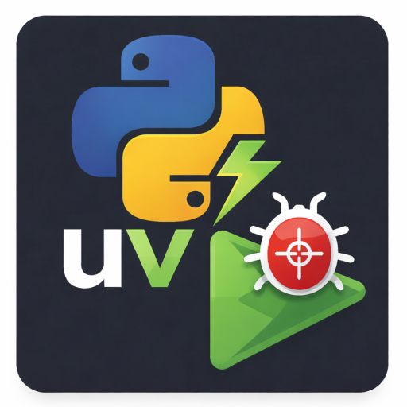

# UV Debug Scripts

Debug `uv` `[project.scripts]` entry points from `pyproject.toml` in VS Code without writing `launch.json`.

This extension detects `uv` projects and lets you launch any script entry point directly into the Python debugger with minimal friction.

## Features

- Detects `[project.scripts]` and `[project.gui-scripts]` in `pyproject.toml`
- Works in single-root and multi-root workspaces
- One-click debug from status bar
- Remembers last run per workspace folder
- Optional arguments prompt
- Detects `.venv` automatically
- Hide/show uninitialized `uv` projects via eye toggle
- No `launch.json` required
- No runtime dependencies (bundled extension)

## Requirements

- VS Code
- Python extension installed
- `uv` project with `pyproject.toml`
- Optional but recommended: `.venv` created via `uv sync`

# Install 
Download **UV Debug Scripts** extension in a folder. From VScode terminal, change directory to the folder.

Type to install the VSCode extension,
```bash
code --install-extension uv-debug-scripts-0.0.5.vsix
```

Check if the extension is installed in VScode from the sidebar.

## How It Works

Given a `pyproject.toml`:

```toml
[project.scripts]
mytool = "mypackage.cli:main"
````

This extension:

1. Parses the entry points
2. Generates a temporary wrapper in `.vscode/`
3. Launches VS Code Python debugger against that entry point
4. Sets `PYTHONPATH` to project root
5. Uses `.venv` interpreter if present


## Usage

### Debug a Script

* Open Command Palette
  → `UV: Debug Script`

Select:

* Workspace folder (if multi-root)
* Script
* Optional arguments

Debugger launches immediately.

### Debug Last Script (Fast)

Status bar:

* `uv` → re-run last script
* `Cmd+Shift+Enter` (Mac) / `Ctrl+Shift+Enter` (Win/Linux)

If no previous args were used, it runs immediately.


### Debug Last Script (Edit Args)

* `Cmd+Shift+Alt+Enter`
* or `UV: Debug Last Script (Edit Args)`


### Hide Uninitialized Projects

Click the eye icon in the status bar:

* 👁 → show all projects
* 👁‍🗨 → hide projects missing `.venv`

State is stored per workspace.


## Multi-Root Behavior

Each workspace folder:

* Has independent script cache
* Remembers its own last run
* Maintains its own hide/show state


## Notes

* If `.venv` is missing, debugging may fail depending on your Python interpreter.
* Recommended workflow:

```bash
uv sync
```

before debugging.


## Why?

`uv` encourages entry points via `[project.scripts]`.

VS Code debugging normally requires manual `launch.json` entries per script.

This extension removes that friction and keeps configuration close to `pyproject.toml`.


## License

MIT

